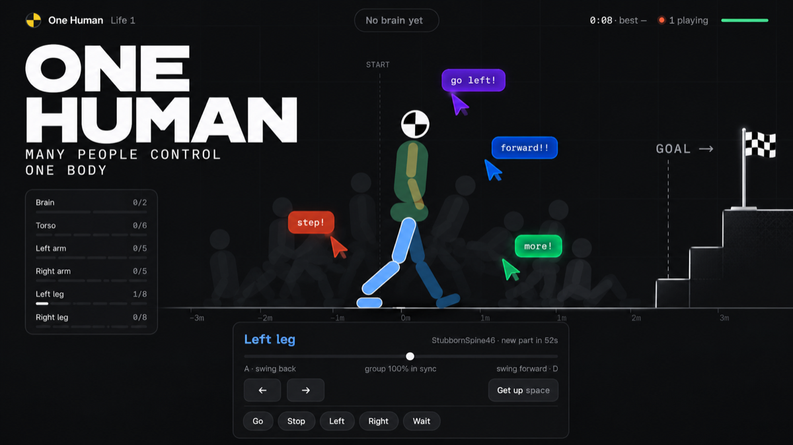

<p align="center">
  
</p>

<h1 align="center">One Human</h1>

<p align="center">
  Everyone online controls the same body. You get one part.<br>
  <a href="https://one-human.vanshsoniofficial.workers.dev"><b>Play it live</b></a> ·
  <a href="https://one-human.vanshsoniofficial.workers.dev/docs">How it works</a>
</p>

---

## The idea

One Human is a browser game where everyone who opens the page shares a single ragdoll. Each player gets one body part: a leg, an arm, the torso, or the brain. Your keys move only your part.

The goal sounds easy: get the human to sit on the chair. But the two leg groups have to take turns, the torso has to keep balance, and nobody can talk properly. So it falls over. A lot.

- **34 seats**: 8 per leg, 5 per arm, 6 torso, 2 brains. Everyone else waits in line and watches.
- **Your group's average moves your limb.** Random input cancels out, so the people who agree win.
- **Only the brain can see the chair.** It gives orders like *Walk right* or *Left leg now*; the body decides whether to follow.
- **Everyone gets a new part every 60 seconds.**
- **The human can die.** Hit its head too hard and a new life starts. Every life and every record is saved.

## How to play

| Key | Action |
| --- | --- |
| `A` / `←` | Push your limb back |
| `D` / `→` | Push your limb forward |
| `Space` | Help it get up after a fall (everyone holds it together) |
| `1`–`9` | Brain only: give an order |

You can also shout one of five calls (Go, Stop, Left, Right, Wait). There is no free-text chat, and names are generated, so there is nothing to moderate.

## How it works

```
 browsers ──wish (one number, -1..1)──▶  Worker  ──/ws──▶  Durable Object "one-human"
    ▲                                                        │  average inputs per body part
    │                                                        │  drive the joint motors
    └──────── body positions, 20×/s ◀────────────────────────│  step the physics (60×/s)
                                                             │  check falls, damage, the chair
                                                             └─ save lives and records
```

- **The server is in charge.** Browsers never send positions, only a number from −1 to 1 for their part plus a heartbeat. The server runs the physics, so a modified client can't teleport the body.
- **One human, one server.** There can only ever be one copy of the game. A Cloudflare Durable Object with a fixed name guarantees exactly that, worldwide.
- **The shared brain.** 60 times a second the server averages every active player on each body part. That average becomes the target angle of the joint's motor.
- **The ragdoll.** 13 rigid bodies and 12 hinge joints in [Rapier](https://rapier.rs) 2D, with joint limits, force-based position motors and a hidden balance assist that keeps it barely upright.
- **Smooth on the client.** Positions arrive 20 times a second; the browser draws 100 ms in the past and blends between updates.
- **Data.** Live state lives in the Durable Object's memory. Lives and records live in its built-in SQLite storage. No accounts, no cookies, no external database.

The [docs page](https://one-human.vanshsoniofficial.workers.dev/docs) explains all of this in 12 short chapters, with an interactive demo of the averaging and the five ways the ragdoll broke before it could walk.

## Run it locally

Requires Node 20+.

```bash
npm install
npm run dev          # Node server with live reload → http://localhost:3000
```

Open the page in several tabs to get several players. The Node version keeps lives and records in `data/state.json`.

To run the Cloudflare version locally:

```bash
npm run cf:dev       # Worker + Durable Object in wrangler → http://localhost:8787
```

## Deploy

```bash
npx wrangler login   # once
npm run cf:deploy
```

`cf:prep` runs automatically first. It rewrites Rapier's loader to use a precompiled `.wasm` file, because Cloudflare Workers don't allow compiling WebAssembly from bytes at runtime.

## Project structure

```
server/src/
  config.ts       seats per body part, tick rates, timings, brain commands
  game.ts         the game: tick loop, averaging, falls, damage, the chair, lives
  ragdoll.ts      the Rapier body, joints, motors and balance assist (see TUNING)
  seats.ts        seats, the waiting line, role assignment and rotation
  names.ts        generated player names
  index.ts        Node server: static files + WebSocket
  fileStore.ts    saves lives and records to data/state.json
worker/
  index.ts        Cloudflare Worker and the HumanRoom Durable Object
scripts/
  build-rapier-worker.mjs   makes Rapier load in Workers
public/
  index.html, client.js     the game page: input, interpolation, canvas drawing
  docs.html                 the "how it works" page
wrangler.jsonc              Cloudflare config
```

The same `Game` class runs on both Node and Cloudflare; only the server wrapper and the storage differ.

## Tuning

Two files decide how the game feels:

- **`server/src/config.ts`**: `SEATS` (players per body part), `ROTATE_MS` (how often parts change), `CHAIR_X` (distance to the chair).
- **`server/src/ragdoll.ts`**, `TUNING`: `balanceK` is the most important number. Below about 700 the body can't stand; too high and it never falls. Motor stiffness, damping and hip range set how strong and fast each limb is.

Run `npm run typecheck` after changes to check both the Node and Cloudflare code.

## Tech

TypeScript · Rapier 2D (WebAssembly) · Cloudflare Workers + Durable Objects · WebSockets · Canvas 2D · Geist
